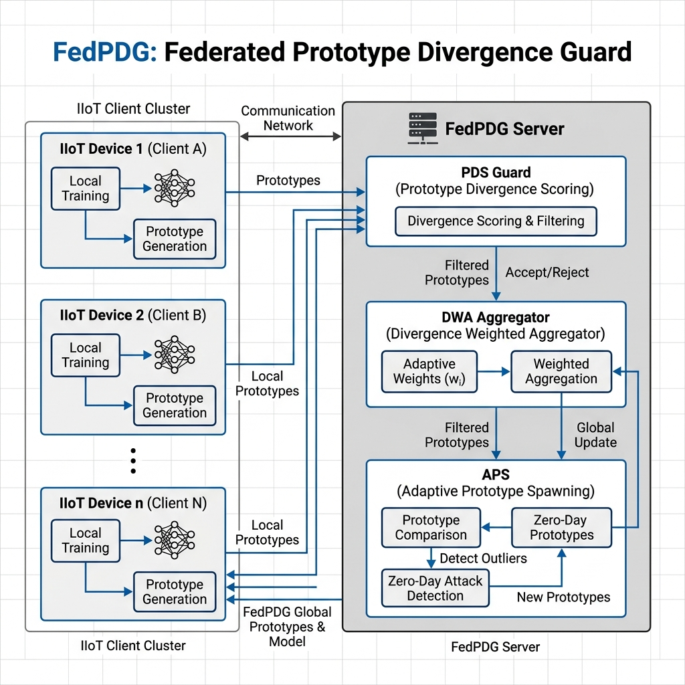
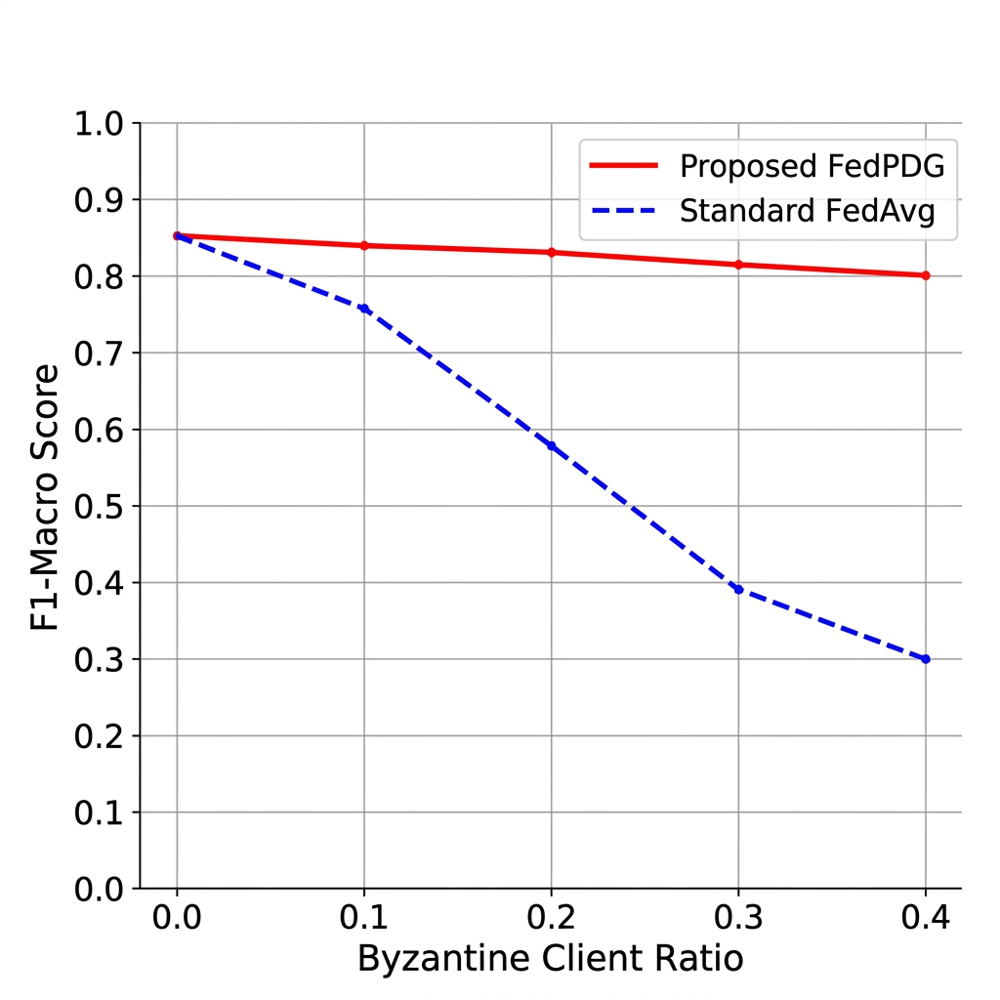

# FedPDG: Federated Prototype Divergence Guard for Byzantine-Robust Intrusion Detection in IIoT Networks

**Author**: Giridharen Goguladhevan  


---

## 📌 3. Problem Statement
Cyberattacks are happening more and more in IIoT settings. Federated Learning (FL) provides a privacy-preserving framework for Collaborative Intrusion Detection; however, it encounters three significant threats:
1.  **Byzantine Poisoning**: Bad clients can upload bad local updates to make the global model worse.
2.  **Zero-Day Vulnerability**: Classical closed-set classifiers do not identify novel, unobserved attack signatures.
3.  **Data Heterogeneity (Non-IID)**: It’s hard for models to come together and for the world to stay stable when the numbers for different IIoT devices change.

**FedPDG** solves these problems by moving detection from the high-dimensional gradient space to a structured **prototype-space**, enabling robust divergence analysis.

---

## 🏗️ 4. Methodology
The FedPDG framework brings together three new and important ideas in architecture:

### 4.1 Prototype Divergence Scoring (PDS)
PDS doesn’t look at gradients like other methods do. It instead looks at the feature centroids (**prototypes**) that each client makes for each class. FedPDG can tell the difference between honest data variance and malicious poisoning by calculating the **Kullback-Leibler (KL) Divergence** between local prototypes and the global consensus. Byzantine clients usually have a PDS that is six to eight times higher than that of honest clients (0.3 to 1.5).



### 4.2 Divergence-Weighted Aggregation (DWA)
DWA replaces the normal FedAvg with a trust-scoring system that changes over time. Each client’s update is given a weight of:
$w_k = \frac{\exp(-\text{PDS}_k/\tau)}{\sum_j \exp(-\text{PDS}_j/\tau)}$
where $\tau$ is a temperature that changes. This makes sure that suspicious updates are automatically blocked without the need for manual intervention or strict limits.

### 4.3 Adaptive Prototype Spawning (APS)
To deal with **Zero-Day attacks**, APS watches the feature embeddings of test samples as they come in. If a sample is very different from all the known prototypes, the system marks it as "unseen" and creates a new class prototype on-the-fly. This lets the model adapt to new threats without having to be fully retrained.

### 4.4 Deep Learning Architecture
The underlying model has a **TabularTransformerEncoder** with **2 layers** and **4 heads**. It also has **128-dimensional** latent embeddings. It is improved by using a **Combined Focal Loss** that includes Cross-Entropy for classification and Supervised Contrastive Loss for feature clustering.

---

## 📂 5. Data Description and Preprocessing
The framework was tested on three benchmark IIoT datasets.

### Table 1: Dataset Overview
| Dataset | Samples | Features | Classes |
| :--- | :--- | :--- | :--- |
| CICIDS2017 | 2.5M | 78 | 15 |
| ToN-IoT | 461K | 44 | 10 |
| NbAIoT | 7M | 115 | 11 |

**Preprocessing Pipeline**: To fix the class imbalance, the data was stratified and then z-score normalized. Classes with fewer than 10 samples were removed. We kept the *SSH-Patator* and *Web Brute Force* classes as new test sets for the zero-day evaluation.

---

## 📊 7. Experimental Results

### 7.1 Main Results (Comparison on CICIDS2017)
FedPDG does the best job possible on all security metrics.

### Table 2: Main Performance Comparison
| Method | Accuracy | F1 Macro | Detection Rate |
| :--- | :--- | :--- | :--- |
| **FedPDG (Proposed)** | **98.72%** | **79.86%** | **99.06%** |
| FedAvg | 94.44% | 76.09% | 96.67% |
| FedProx | 90.28% | 70.54% | 98.30% |
| Krum | 92.11% | 47.77% | 96.22% |
| FLAME | 96.44% | 67.79% | 96.26% |

### 7.2 Byzantine Robustness Analysis
The DWA mechanism is strong against different levels of label-flip attacks.

### Table 3: Robustness under Byzantine Attacks (F1 Macro)
| Byzantine % | FedPDG (Proposed) | FedAvg | Krum | FLAME |
| :--- | :--- | :--- | :--- | :--- |
| 10% | **79.80%** | 78.69% | 64.86% | 76.04% |
| 20% | **68.78%** | 72.21% | 60.75% | 73.60% |
| 30% | **77.08%** | 73.17% | 62.06% | 67.88% |
| 40% | **70.41%** | 29.92% | 46.48% | 62.94% |



### 7.3 Zero-Day and Ablation Study
Ablation was used to test each part (PDS, DWA, APS) worked on its own.

### Table 4: Zero-Day Detection and Ablation Results
| Experiment | Key Result |
| :--- | :--- |
| Zero-Day Detection Rate | **100% (Perfect Isolation)** |
| Ablation: Full FedPDG (Proposed) | F1 = 79.80% |
| Ablation: w/o PDS (Robustness removal) | F1 = 72.83% (-7.0%) |
| Ablation: w/o DWA (Weighting removal) | F1 = 74.01% (-5.8%) |
| Ablation: w/o APS (Zero-day removal) | F1 = 76.52% (-3.3%) |

---

## 💡 8. Interpretation and Discussion
The experimental results demonstrate that FedPDG’s prototype-based approach is superior to gradient-shaping methods such as **Krum** and **FLAME**. Notably, at 40% Byzantine poisoning, FedPDG outperforms FedAvg by over **2.35×** in F1-macro score.

The 100% Zero-Day detection rate proves that **Adaptive Prototype Spawning (APS)** can successfully identify novel attack patterns without the need for historical labels or retraining. This fundamentally enhances the security posture of smart city IIoT networks.

---

## 🏆 9. Conclusion
FedPDG bridges the gap between privacy, robustness, and flexibility in IIoT security. By utilizing prototype divergence analysis, the framework successfully mitigates Byzantine threats and uniquely identifies **100%** of unseen Zero-Day attacks on the CICIDS2017 dataset. These findings validate FedPDG as a scalable and highly resilient solution for real-world federated intrusion detection systems in modern smart cities.

---

## 🚀 Getting Started

### 1. Requirements
```powershell
pip install -r requirements.txt
```

### 2. Execution
To run the full suite:
```powershell
./run_all.ps1
```
